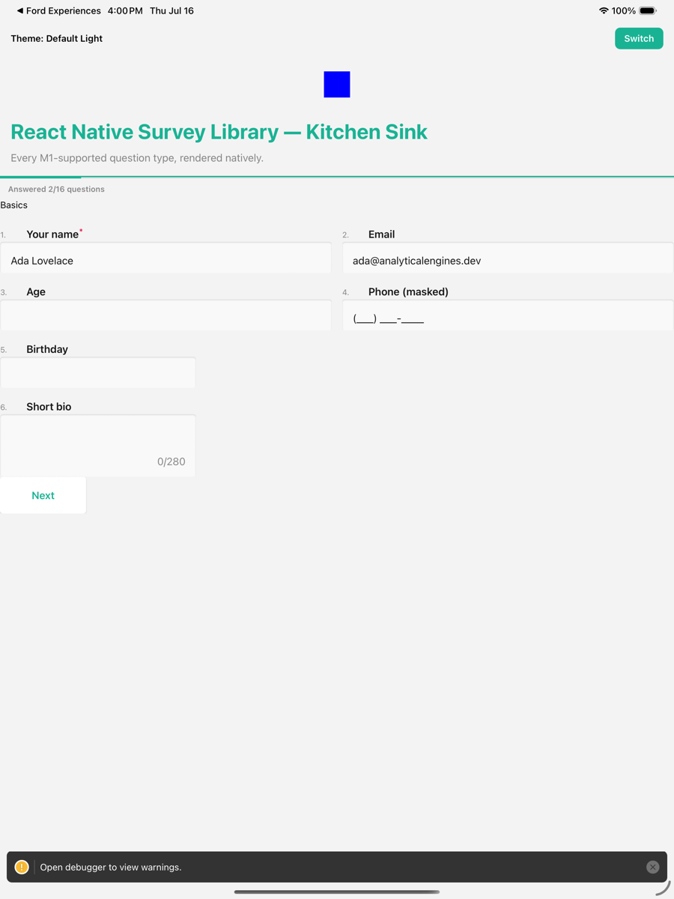
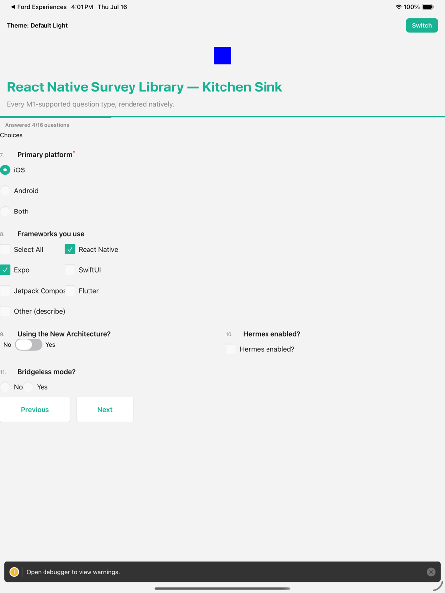
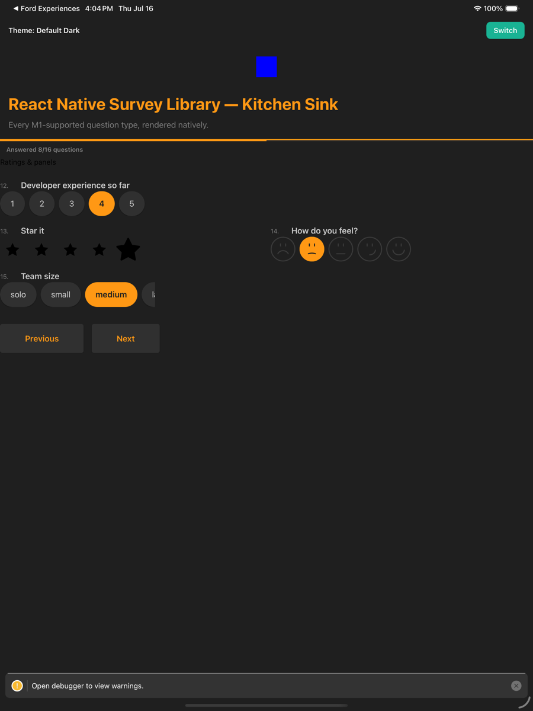
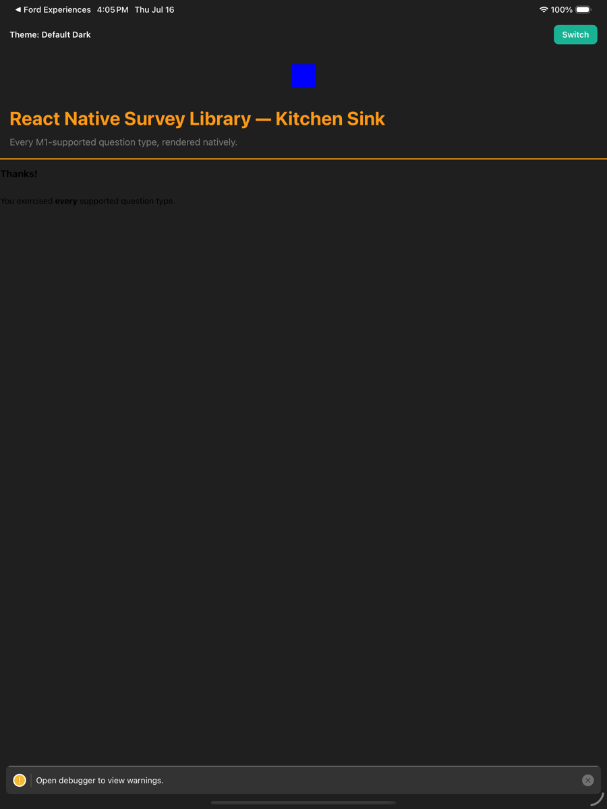

# @iotashan-llc/react-native-survey-library

React Native rendering engine for the [SurveyJS Form Library](https://surveyjs.io/form-library/documentation/overview) 2.x. Pass your existing SurveyModel JSON + Theme JSON **unmodified** and get a native survey — no WebView.

- **Runtime/rendering only** — no Creator, no Dashboard, no Analytics.
- Targets **Expo SDK 57** (React Native 0.86, React 19.2, New Architecture), iOS + Android. Web users keep the official `survey-react-ui`.
- `survey-core` stays an **unmodified peer dependency** — the same model, expressions, validation, and theme JSON you run on web.

## Installation

```sh
npm install @iotashan-llc/react-native-survey-library survey-core
```

Required peer dependencies (batteries-included — install once). Each backs a specific capability and is lazy-loaded only when a question needs it:

```sh
# native modules — install with expo so versions match your SDK
npx expo install react-native-svg react-native-gesture-handler \
  react-native-reanimated @react-native-community/slider \
  react-native-webview expo-video expo-image-picker expo-document-picker

# JS-only
npm install @native-html/render react-native-signature-canvas
```

| Peer | Backs |
|---|---|
| `react-native-svg` | rating stars/smileys, `imagemap` hotspots, SVG icons |
| `react-native-gesture-handler` + `react-native-reanimated` | `ranking` drag, `matrixdynamic` row reorder |
| `@react-native-community/slider` | `slider` (single); range uses a custom dual-thumb |
| `react-native-signature-canvas` | `signaturepad` |
| `react-native-webview` | `signaturepad` canvas, YouTube `image` embeds |
| `expo-video` | `image` `contentMode: video` |
| `expo-image-picker` + `expo-document-picker` | `file` (camera / gallery / document) |
| `@native-html/render` | rich HTML rendering |

A missing peer degrades **only** the question that needs it — a non-throwing fallback + diagnostic, never a crash.

## Quick start

```tsx
import { Survey } from '@iotashan-llc/react-native-survey-library';
import { DefaultLight } from 'survey-core/themes';

const json = {
  title: 'Feedback',
  pages: [
    {
      elements: [
        { type: 'text', name: 'name', title: 'Your name', isRequired: true },
        { type: 'rating', name: 'score', title: 'Rate us', rateType: 'stars' },
        { type: 'comment', name: 'notes', title: 'Anything else?' },
      ],
    },
  ],
};

export default function FeedbackScreen() {
  return (
    <Survey
      json={json}
      theme={DefaultLight}
      onComplete={(sender) => console.log(sender.data)}
    />
  );
}
```

`json` is preflighted before model construction (URL policy below). Prefer owning the model? Pass `model={new Model(json)}` instead — host-owned models are treated as trusted and never disposed by the component.

## Screenshots

The bundled kitchen-sink example (iPad Pro 13" simulator) — same SurveyModel JSON you'd run on web, rendered natively:

| Text inputs, masks, validation | Choice questions |
|---|---|
|  |  |

| Ratings & themes | Completion |
|---|---|
|  |  |

## Supported question types

Every type below renders natively from the same SurveyModel JSON you'd run on web. Anything not listed renders a **non-throwing fallback panel** with a structured diagnostic — an unsupported type never crashes the survey.

| Category | Types |
|---|---|
| **Text & input** | `text` (all 13 inputTypes, input masks, character counter), `comment`, `multipletext` |
| **Choice** | `radiogroup`, `checkbox` (columns, Select All, Other), `dropdown`, `tagbox`, `boolean` (default/checkbox/radio renderAs), `imagepicker`, `buttongroup` |
| **Rating & ranking** | `rating` (numbers/stars/smileys/custom rateValues, dropdown renderAs), `ranking`, `slider` (single + range) |
| **Matrix family** | `matrix`, `matrixdropdown`, `matrixdynamic` (add/remove/reorder rows) |
| **Media & rich** | `image` (+ `contentMode: video`), `imagemap`, `signaturepad`, `file` (camera / gallery / document pickers), `html` |
| **Structure** | `panel`, `paneldynamic` (add/remove, carousel), multi-element rows, pages, `expression` |
| **Custom** | `ComponentCollection` **custom** + **composite** components |

**Survey shell:** navigation (start/prev/next/preview/complete), progress as a **percentage bar**, **page-step buttons**, or a **table-of-contents** drawer; **advanced header/cover** (background image + 3×3 positioning); **timer panel**; **notifier** toasts; completed / loading / empty-state frames; and the full theme JSON pipeline (validated across all 40 `survey-core/themes`, golden snapshots for the curated set).

> Runtime/rendering only — no Creator, Dashboard, or Analytics. See [docs/DIFFERENCES.md](docs/DIFFERENCES.md) for every observable divergence from `survey-react-ui`, each with its rationale.

## Security defaults (different from web — deliberate)

- HTML content (`completedHtml`, descriptions, …) renders through a sanitizer: tag/attribute allowlist, no inline CSS, resource bounds.
- Every URL passes a central scheme/origin policy: `https:` only for automatic fetches, and **no remote origin is fetched until you allowlist it** via the `uriPolicy` prop (`{ allowedOrigins: ['https://api.example.com'] }`). One config covers the JSON preflight and every render-time sink.
- Links never auto-navigate — supply `onLinkPress` and decide in the host app.

See [docs/DIFFERENCES.md](docs/DIFFERENCES.md) for every observable divergence from `survey-react-ui`, each with its rationale and workaround.

## Example app

```sh
cd example
npx expo run:ios   # kitchen-sink survey + theme switcher
```

## Contributing

- [Development workflow](CONTRIBUTING.md#development-workflow)
- [Sending a pull request](CONTRIBUTING.md#sending-a-pull-request)
- [Code of conduct](CODE_OF_CONDUCT.md)

## License

MIT

---

Made with [create-react-native-library](https://github.com/callstack/react-native-builder-bob)
